# LifeStack

A personal life-tracking app built with Expo (React Native) — habits, to-dos, sleep, and budgeting in one place, backed by on-device SQLite.

## Screenshots

Every screen supports both themes — toggle in Settings.

<table>
  <tr>
    <th align="center" width="240">Light</th>
    <th align="center" width="240">Dark</th>
  </tr>
  <tr>
    <td align="center">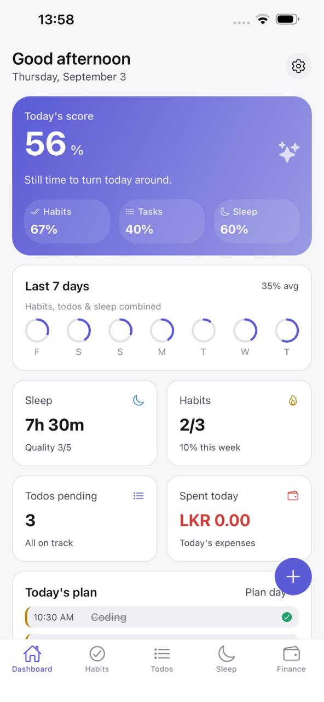</td>
    <td align="center">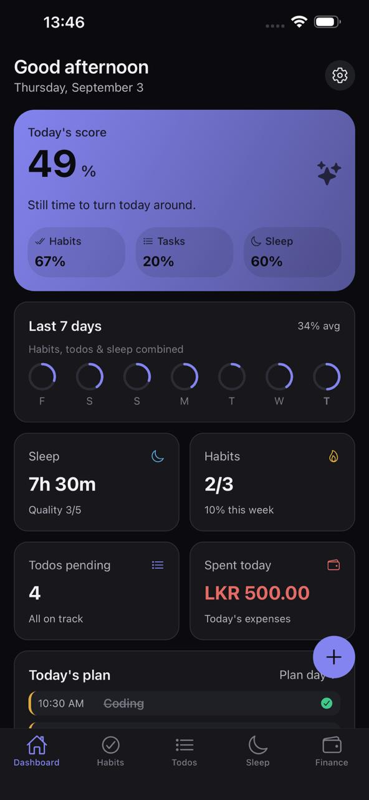</td>
  </tr>
  <tr><td colspan="2" align="center"><sub>Dashboard</sub></td></tr>
  <tr>
    <td align="center">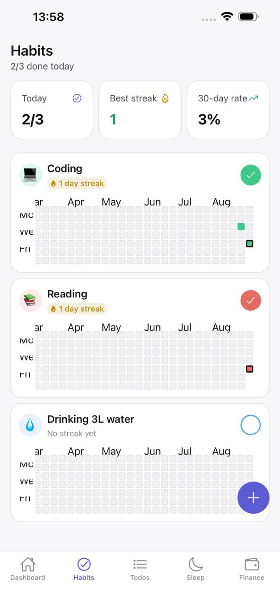</td>
    <td align="center">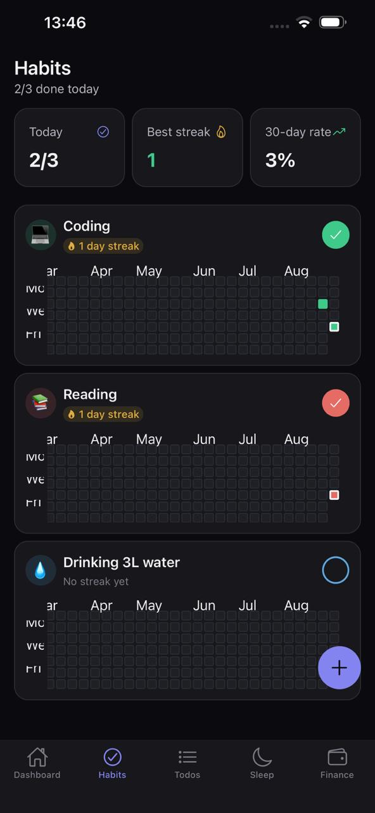</td>
  </tr>
  <tr><td colspan="2" align="center"><sub>Habits</sub></td></tr>
  <tr>
    <td align="center">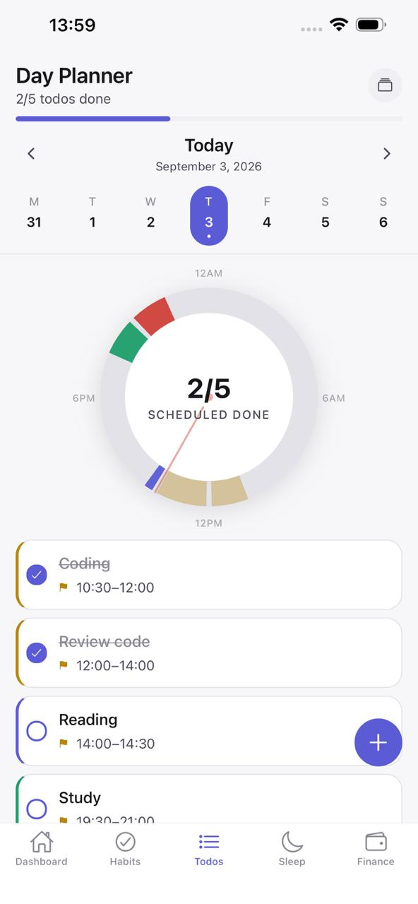</td>
    <td align="center">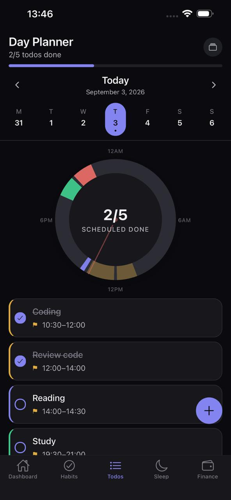</td>
  </tr>
  <tr><td colspan="2" align="center"><sub>Day Planner</sub></td></tr>
  <tr>
    <td align="center">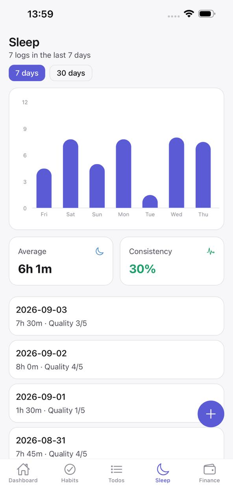</td>
    <td align="center">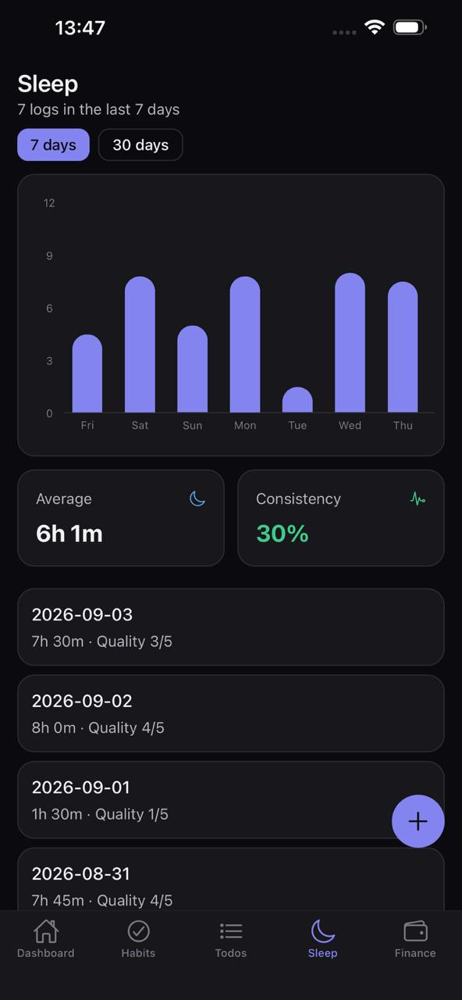</td>
  </tr>
  <tr><td colspan="2" align="center"><sub>Sleep</sub></td></tr>
  <tr>
    <td align="center">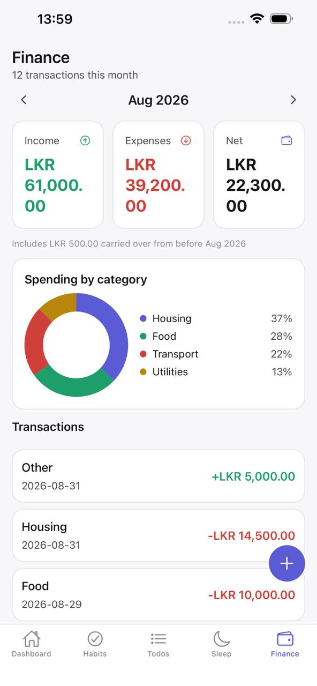</td>
    <td align="center">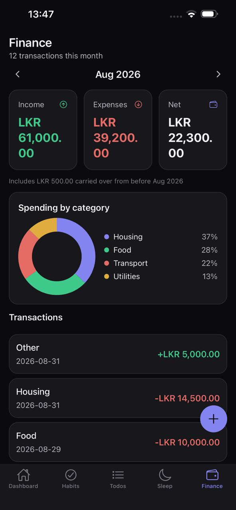</td>
  </tr>
  <tr><td colspan="2" align="center"><sub>Finance</sub></td></tr>
  <tr>
    <td align="center">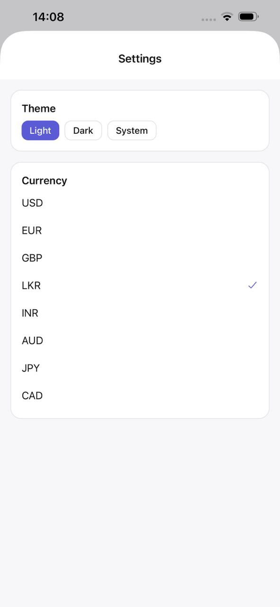</td>
    <td align="center">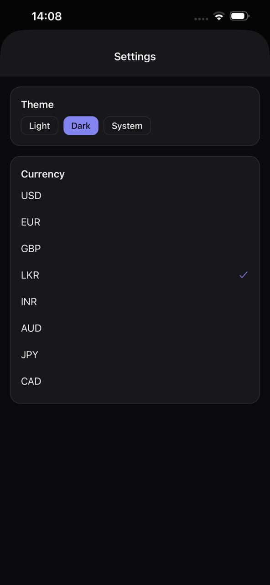</td>
  </tr>
  <tr><td colspan="2" align="center"><sub>Settings</sub></td></tr>
</table>

## Tech stack

- **Expo SDK 57** + **Expo Router** (file-based routing)
- **React Native 0.86** / **React 19**
- **expo-sqlite** + **Drizzle ORM** (schema, migrations, typed repositories)
- **NativeWind** (Tailwind CSS for React Native) for styling and theming
- **Zustand** for client state
- **TypeScript** (strict mode)

> This project tracks Expo SDK 57 closely — check the [versioned Expo docs](https://docs.expo.dev/versions/v57.0.0/) before assuming API behavior.

## Getting started

```bash
npm install
npm start        # opens Expo dev tools
npm run android   # run on Android emulator/device
npm run ios       # run on iOS simulator/device
```

> **Web is not supported.** LifeStack relies on on-device SQLite via `expo-sqlite`, whose web backend is alpha and needs response headers the dev server doesn't send. Running `npm run web` shows a notice instead of the app — use Expo Go or an emulator/simulator.

## Project structure

```
app/                       # Expo Router screens (file-based routing)
  _layout.tsx                # Root layout: theme provider, migration gate, status bar
  settings.tsx                # Modal settings screen (theme + currency)
  (tabs)/
    _layout.tsx                # Bottom tab bar (Dashboard, Habits, Day Planner, Sleep, Finance)
    index.tsx                   # Dashboard — hero day score, 7-day overview, quick add
    habits/                     # Habits list + detail (streaks, heatmap)
    todos.tsx                    # Day Planner — 24-hour donut clock + checklist
    sleep.tsx                     # Sleep logs, bar chart, consistency
    finance.tsx                    # Monthly transactions, category breakdown

src/
  components/             # One folder per domain (dashboard/finance/habits/sleep/todos), plus a shared ui/
  db/
    schema.ts               # Drizzle table definitions (source of truth for the DB shape)
    client.ts                 # SQLite client setup
    migrate.ts                  # useDatabaseMigrations() hook, runs pending migrations on launch
    drizzle/                      # Generated SQL migrations + snapshots (drizzle-kit)
    repositories/                   # Typed data-access layer, one module per domain
  hooks/                   # Derived-stats hooks (useHabitStats, useFinanceStats, ...)
  store/                   # One Zustand store per domain (habitsStore, todosStore, ...)
  theme/
    tokens.ts               # Design tokens (colors, spacing, etc.)
    accentPalette.ts           # Shared theme-aware color palette (habit colors, per-task colors, ...)
    ThemeProvider.tsx            # Light/dark theme context

drizzle.config.ts      # drizzle-kit config (schema path, migrations output)
tailwind.config.js     # NativeWind/Tailwind config
```

## Data model

Defined in `src/db/schema.ts`, with a typed repository per table under `src/db/repositories/`:

| Table | Purpose |
|---|---|
| `habits` / `habit_logs` | Habit definitions (daily/weekly) and per-day completion logs |
| `todos` | Tasks with priority, due date, tag, and completion state |
| `sleep_logs` | Bedtime/wake time, computed duration, and sleep quality |
| `transactions` | Income/expense entries by category |
| `budgets` | Monthly spending limit per category |
| `settings` | Simple key/value app settings |

Conventions (enforced by callers, not the DB — see comments in `schema.ts`):
- Calendar-day columns (`date`, `due_date`, `month`) are local `YYYY-MM-DD` strings, never UTC-derived.
- Full-instant columns (`created_at`, `completed_at`, `bedtime`, `wake_time`) are ISO 8601 datetime strings.
- Repositories never call `new Date()`/`Date.now()` directly — timestamps are always supplied by the caller, keeping repositories pure and easy to test.
- Currency amounts are stored as plain decimals (e.g. `12.50`), not integer minor units.

## Database migrations

Schema changes go through [drizzle-kit](https://orm.drizzle.team/kit-docs/overview):

```bash
npx drizzle-kit generate   # generate a new SQL migration from schema.ts changes
```

Migrations run automatically on app launch via `useDatabaseMigrations()` in `src/db/migrate.ts`; the root layout blocks rendering behind a migration gate until they complete.

## Status

All five tabs are built and wired to on-device SQLite:

- **Dashboard** — a hero "day score" blending habits/todos/sleep, a 7-day overall-progress strip, quick stats, and a themed quick-add sheet.
- **Habits** — streaks, a GitHub-style completion heatmap, and a themed accent-color picker (light/dark aware).
- **Day Planner** (Todos) — a 24-hour donut-chart clock (color-coded per task, overlapping tasks split into concentric lanes) with a day-by-day checklist underneath.
- **Sleep** — bedtime/wake logging with a responsive bar chart (7/30-day ranges) and a consistency score.
- **Finance** — monthly income/expense/net (carrying a running balance forward from prior months) with a category breakdown.

Settings (theme preference, currency) is a modal screen reachable from the Dashboard's gear icon.
